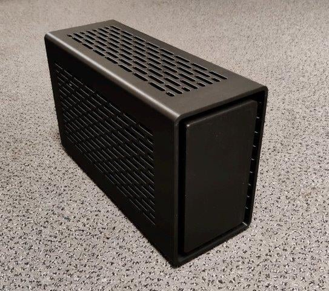
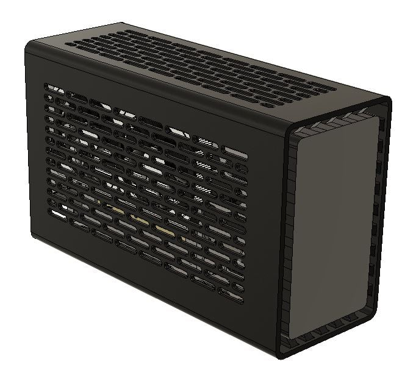
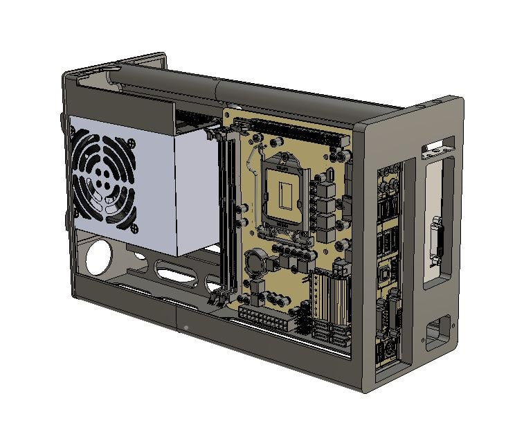

# Thor Zone Mjolnir ITX PC Case

Based on the Thor Zone Mjolnir design and shared on here with their permission on a not for profit basis, this is a 3D printable ITX PC case.

This is not a production tested design so following any of this information is entirely at your own risk but there are many successful builds out there.

Only attempt this build if you are competent, understand the risks and you are experienced with electrical or electronic systems or really just like to live life on the edge - just don't come back to me

PC Parts contain high voltages so there is a risk of electrocution

PC Parts generate significant heat and there is a fire risk if the PC is not correctly designed

There is no external mains isolation switch on the case, this is similar to microwave ovens, sandwich toasters etc. so the wall plug should be accessible

My selection of parts is not a recommendation either and parts may not all fit easily and may need adjusting

This case is 8.2 litres 345 x 212 x 131mm (13.6 x 8.4 5.2 inches) that fits a standard size ITX Motherboard, full length GPU and SFX PSU.

There is also space for 2x 2.5" SSD/HDD's though I'm using an M.2 drive

A capacitive touch switch can be mounted behind the front panel to tun the PC on and off.

The external styling is inspired by the Thor Zone MJOLNIR and this design has been shared on a non-commercial basis with their agreement - https://thor-zone.com/mini-itx/

All 3D Printable items have been produced on a non-commercial basis by Andrew Benjamin and are offered for others to use freely

If you like the design and want to support more work on the PC chassis I would welcome contributions to allow me to buy more printer filament!

## Notes on the TTP223 Capacitive Switch

The switch has a 5mm range so the PC can be turned on by brushing your hand over the right spot on the front cover

The switch sensitivity auto adjusts but may be affected by choice of filament. Mine works well through a 1mm layer of PETG Carbon fibre

To prevent accidental shut down (I put my hand on the sensor while moving the case!) disable the switch 'Power Off' function in Win 10 control panel

TTP223 needs +5v permanent live to work as an 'On Switch', which should be available from the PSU or on sometimes on a USB header, check the motherboard details.

TTP223 I/O pin provides a Pull-Up or Pull-Down, Momentary or Latching, signal based on the settings on the A and B jumpers

AB=00 : No-lock High TTL level output;

AB=01 : Self-lock High TTL level output;

AB=10 : No-lock Low TTL level output; (this worked for my motherboard)

AB=11 : Self-lock Low TTL level output;

## Components

ITX Motherboard, CPU, low profile memory etc.

Cooler - low profile on CPU to suit your components and cooling loads e.g. Noctua L9-I

GPU - 2 slots and up to full length but watch the height! Some GPU's have protruding heat pipes.

SFX PSU - suggest modular or cut back and insulate spare connectors to keep the wiring neat!

PCI Express 16x Flexible Riser - needs to be at least 235mm end to end including connectors, check the position of mounting holes on at the end of the ribbon

IEC Cable with 90 deg connector or IEC C14 Chassis to IEC 90 Degree C13 Extension (Optionally construct this form parts at your own risk)

Capacitive Touch switch e.g. TTP223 and mini-connectors or use a push switch mounted through the back panel

Fixings - see list below

## Parts to Print

All parts print without supports

You might just get all the prints from a 1kg roll

Use thicker walls for strength, 0.45 line with 0.4 nozzle and increase flow on inner walls to get better layer adhesion

PLA not recommended due to low temperature stability

The shell is the largest item is 345mm high x 212mm x 131mm, ~700 g and 4 days

PC Case Shell.stl - Works well in PETG Carbon Fibre, 0.4 nozzle, 0.2 layers, print on 6-inch-wide painters tape to get textured front finish

PC Chassis for ITX and GPU.stl - Check printing tolerances for embedded nuts

PC Chassis for SFX PSU.stl - Check printing tolerances for spigots that join to ITX Chassis

SSD and Capacitive Touch Switch bracket.stl - Hot Glue TTP223 flush in locator on front of bracket

PC Case thumb nut head.stl - Glue to 4mm Socket Head Cap Screw (SHCS) to make thumb turn cover screw, the head on the SHCS may need filing down on diameter due to close tolerances

IEC Cover boot.stl - Provides a cover if using an IEC chassis connector - NOTE: This is not designed as an insulator. The IEC connector should be properly insulated as per manufacturers instruction

IEC Hole Cover Plate.stl - Provides a cover if using a pass-through cable.

Screws (recommend Socket Head Cap Screws)
M4 x 10mm Screw - 1 off for Case cover retention NOTE: the SHCS head diameter may need filing (or turning) down to fit the optional screw cap

M4 x 10mm Screw - 2 off for GPU Mounting

M3 x 10mm Screws - 4 off for ITX Motherboard

M3 x 10mm Screws - 2 off for GPU Extension Cable header bracket

M3 x 10mm Screws - 4 off for SSD/HDD mounting bracket

Mounting screws for SSD/HDD to suit device(s)

Mounting screws for SFX to suit device

Embedded Knurled Nuts
M4 x 4 long x 6 dia - 1 off for Case cover retaining

M4 x 4 long x 6 dia - 2 off for GPU back plate mounting

M3 x 6 long x 5 dia - 4 off for ITX mounting

M3 x 6 long x 5 dia - 2 off for retaining GPU extension header cable bracket

M3 x 6 long x 5 dia - 4 off for SSD/HDD mounting bracket

## Print Settings

Printer brand:
Creality

Printer:
CR-10

Rafts:
No
Supports:
No
Resolution:
0.2
Infill:
25%
Filament brand:
Generic

Filament color:
Black

Filament material:
PETG CF

Notes:

- All parts print without supports
- You might just get all the prints from a 1kg roll
- Use thicker walls for strength, 0.45 line with 0.4 nozzle and increase flow on inner walls to get better layer adhesion
- PLA not recommended due to low temperature stability
- The shell is the largest item is 345mm high x 212mm x 131mm, ~700 g and 4 days
